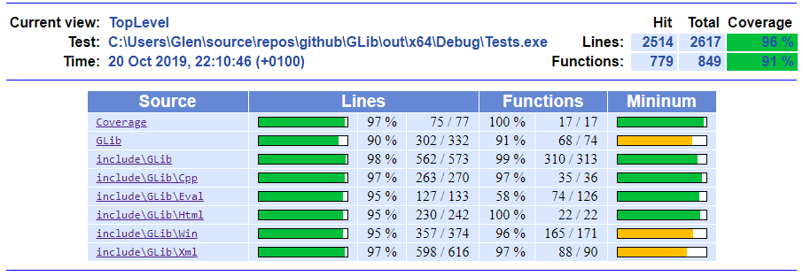
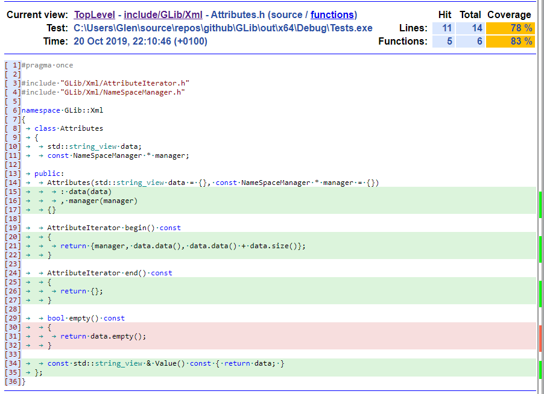

# GLib
This repository is a holdall for a collection C++ utilities created over a number of years to try and augment writing applications/services/utilities on Microsoft Windows. The goals were low dependencies, testability, readability, and modernisation, target is C++17. Utf8 is used throughout and converted to Utf16 at Windows Api boundaries as per http://utf8everywhere.org/.

## Utilities include:
* Logging: FLog, (yet another f-ing log library)
* CheckedCast: bounds checked numeric value conversion
* A basic compatibility layer to allow compilation on non-Windows systems, currently just Linux/GCC.
* Utf8<->Utf16 conversion wrappers to convert around Windows api calls
* String split iterators
* Scope macro to invoke a lambda during scope exit
* StackOrHeap optimisation for two-shot win api calls, reserves stack but can allocate heap if the stack was insufficient
* Evaluator: add C++ values/containers to an in-memory data store and evaluate/iterate properties to strings/ostreams
* TemplateEngine: uses Evaluator to implement a Thymeleaf like html generator, used by C++ coverage html report
* XmlStateEngine and C++ iterator: Used by TemplateEngine
* Formatter until C++20. I wrote this before noticing there was a similar C++20 specification. This version uses printf format strings
* Basic span until C++20, primarily to avoid Clang tidy warnings from pointer arithmetic

## WindowsSpecific
* Windows handle smart pointers
* Process Utilities
* Windows Exceptions from Api/Com error codes
* ComPtr type
* Implement Com types with static TypeLists\TypeFilters
* ComCast method to call QueryIterface for ComPtr's
* Registry access
* DebugStream: ostream based stream to write to OutputDebugStream
* SymbolEngine: Used by Code coverage application to generate code coverage
* Filesystem utilities: some handy Windows file system calls returning std::filesystem::path types;
* Debugger, CodeCoverage, Html Coverage report tool: Produces output code similar to LCOV, also adds C++ syntax highlighting source code output

## Testing
Boost test is used, the project expects Boost to be present in a directory up the path from the repository in a directory [[(../)*]ExternalDependencies/boost_[Ver]_TEST].
One of my other github utility repositories ./BoostModularBuild can be used to download and install boost test and dependencies via command line into an upstream ./ExternalDependencies/ directory, or if not present it will be installed to a temp directory. This mechanism is used to allow automatic download and install of dependencies without administrator privileges, and for a single hive of source code repositories.

## Build
The build system allows multiple mechanisms, It can compile and run build targets for a VisualStudio solution and from a mirrored CMake project. The CMake project also compiles on Linux/GCC for a basic compatibility test. The Visual Studio and CMake projects include a search facility to search up the directory tree to locate the ExternalDependencies directory.
The Windows command-line build is from a go.cmd at root level which checks Visual Studio requirements then forwards on to an custom MsBuild project

### From a Windows prompt download BoostModularBuild which then downloads and aggregates Boost Test modules to an ExternalDependencies directory:

	>go deps
	...
	C:\Users\Glen\source\ExternalDependencies\boost_1_69_0_test
	Path Files     Size
	---- -----     ----
	      4113 37791006

### Build and run all tests for Windows Visual Studio target:

	>go
	...
	Test:
	C:\Users\Glen\source\repos\github\GLib\out\x64\Release\Tests.exe
	Running 261 test cases...

### Build and run all tests for Windows/Visual Studio, Windows CMake and Linux/GCC.

	>go all

### Build and run tests for Windows/Visual Studio, generate coverage information and launch a Html coverage report via the built in GLib coverage tool.

	>go coverage

### Build and run tests for Linux build via wsl, generate coverage information and launches a Html coverage report via LCOV.

	>go wslcoverage

### Delete all build and temporary files

	>go clean

## Linux Build
	$./go.sh {build|coverage|clean}

## Code Examples
### Logging: FLog, (yet another f-ing log library)
	auto log = GLib::Flog::LogManager::GetLog<Fred>();
	log.Info("Start");
	{
		GLib::Flog::ScopeLog scope1(log, GLib::Flog::Level::Info, "Scoop");
		log.Info("Middle");
		(void) scope1;
	}
	log.Info("End");

#### Output:
	------------------------------------------------
	Opened      : 24 Oct 2019, 17:03:05 (+0100)
	OpenedUtc   : 2019-10-24 16:03:05Z
	ProcessName : (64 bit) Tests.exe
	FullPath    : C:\Users\Glen\source\repos\github\GLib\msvc\x64\Debug\Tests.exe
	ProcessId   : 6868
	ThreadId    : 14748
	------------------------------------------------
	24 Oct 2019, 17:03:05.593 : [ 14748 ] : INFO     : FlogTests::Fred  : Start
	24 Oct 2019, 17:03:05.594 : [ 14748 ] : INFO     : FlogTests::Fred  : ==> Scoop
	24 Oct 2019, 17:03:05.594 : [ 14748 ] : INFO     : FlogTests::Fred  : Middle
	24 Oct 2019, 17:03:05.595 : [ 14748 ] : INFO     : FlogTests::Fred  : <== Scoop 1.5ms
	24 Oct 2019, 17:03:05.599 : [ 14748 ] : INFO     : FlogTests::Fred  : End
	------------------------------------------------
	Closed       24 Oct 2019, 17:03:05 (+0100)
	------------------------------------------------

### Generic Utils
#### CheckedCast
	BOOST_TEST(1234u == checked_cast<unsigned int>(static_cast<short>(1234)));
	BOOST_TEST(static_cast<unsigned int>(std::numeric_limits<short>::max()) == checked_cast<unsigned int>(std::numeric_limits<short>::max()));
	BOOST_CHECK_EXCEPTION(checked_cast<unsigned int>(std::numeric_limits<short>::min()), Exception, IsUnderflow);

#### Utf8<->Utf16 conversion wrappers
	std::string utf8Value = "\xE2\x82\xAC";
	std::wstring utf16Value = L"\u20AC";

	BOOST_TEST(utf16Value == GLib::Cvt::a2w(utf8Value));
	BOOST_TEST(utf8Value == GLib::Cvt::w2a(utf16Value));

#### String split
	GLib::Util::SplitterView s("a<->bc<->def<->ghijkl", "<->");
	std::vector<std::string_view> expected { "a", "bc", "def", "ghijkl" };
	BOOST_CHECK_EQUAL_COLLECTIONS(expected.begin(), expected.end(), s.begin(), s.end());

#### Scope macro
	BSTR description = nullptr;
	pErrorInfo->GetDescription(&description);
	SCOPE(_, [=] () noexcept
	{
		::SysFreeString(description);
		pErrorInfo->Release();
	});

#### StackOrHeap
	inline std::string PathOfFileHandle(HANDLE fileHandle, ULONG flags)
	{
		Util::StackOrHeap<wchar_t, DefaultStackReserveSize>
		ULONG length = ::GetFinalPathNameByHandleW(fileHandle, nullptr, 0, flags);
		Util::AssertTrue(length != 0, "GetFinalPathNameByHandleW failed");
		s.EnsureSize(length);
		length = ::GetFinalPathNameByHandleW(fileHandle, s.Get(), static_cast<ULONG>(s.size()), flags);
		Util::AssertTrue(length != 0 && length < s.size(), "GetFinalPathNameByHandleW failed");
		return Cvt::w2a(std::wstring_view{s.Get(), length});
	}

#### Evaluator
	struct User
	{
		std::string name;
		int age;
		std::list<std::string> hobbies;
	};

	template <>
	struct GLib::Eval::Visitor<User>
	{
		static void Visit(const User & user, const std::string & propertyName, const ValueVisitor & f)
		{
			if (propertyName == "name")
			{
				return f(Value(user.name));
			}
			if (propertyName == "age")
			{
				return f(Value(user.age));
			}
			if (propertyName == "hobbies")
			{
				return f(MakeCollection(user.hobbies));
			}
			throw std::runtime_error(std::string("Unknown property : '") + propertyName + '\'');
		}
	};

	BOOST_AUTO_TEST_CASE(AddStruct)
	{
		GLib::Eval::Evaluator evaluator;
		User user {"Zardoz", 999, {}};
		evaluator.Set("user", user);

		std::string name = evaluator.Evaluate("user.name");
		BOOST_TEST(name == "Zardoz");
		std::string age = evaluator.Evaluate("user.age");
		BOOST_TEST(age == "999");
	}

#### TemplateEngine
	BOOST_AUTO_TEST_CASE(ForEach)
	{
		const std::vector<User> users
		{
			{ "Fred", 42, { "FC00"} }, { "Jim", 43, { "FD00"} }, { "Sheila", 44, { "FE00"} }
		};
		Evaluator evaluator;
		evaluator.SetCollection("users", users);

		auto xml = R"(<xml xmlns:gl='glib'>
	<gl:block each="user : ${users}">
		<User name='${user.name}' />
	</gl:block>
	</xml>)";

		std::ostringstream stm;
		Generate(evaluator, xml, stm);

		auto expected= R"(<xml>
		<User name='Fred' />
		<User name='Jim' />
		<User name='Sheila' />
	</xml>)";

		BOOST_TEST(stm.str() == expected);
	}

#### XmlStateEngine and iterator
	BOOST_AUTO_TEST_CASE(Attributes)
	{
		Xml::Holder xml { R"(<root a='1' b='2' >
		
	</root>)" };

		std::vector<Xml::Element> expected
		{
			{"root", Xml::ElementType::Open, {"a='1' b='2'" }},
			{"sub", Xml::ElementType::Empty, {"c='3' d=\"4\""}},
			{"root", Xml::ElementType::Close, {}},
		};
		BOOST_CHECK_EQUAL_COLLECTIONS(expected.begin(), expected.end(), xml.begin(), xml.end());
	}

#### Formatter
	BOOST_AUTO_TEST_CASE(TestRepeatedInsert)
	{
		std::string s = Formatter::Format("{0} {0:%x}", 1234);
		BOOST_TEST("1234 4d2" == s);
	}

	BOOST_AUTO_TEST_CASE(TestSprintfFormatPassThrough)
	{
		std::string s = Formatter::Format("{0:%#.8X}", 1234);
		BOOST_TEST("0X000004D2" ==s);
	}

### Windows Utilities

#### Windows handle smart pointers / Process Utilities
	BOOST_AUTO_TEST_CASE(TestProcess)
	{
		GLib::Win::Process p(R"(c:\windows\system32\cmd.exe)");
		{
			auto scopedTerminator = p.ScopedTerminator();
			BOOST_TEST(p.IsRunning());
			(void)scopedTerminator;
		}

		BOOST_TEST(!p.IsRunning());
		BOOST_TEST(1U == p.ExitCode());
	}

#### Windows Exceptions from Api/Com error codes
	BOOST_AUTO_TEST_CASE(TestErrorCheck)
	{
		::SetLastError(ERROR_ACCESS_DENIED);
		GLIB_CHECK_EXCEPTION(GLib::Win::Util::AssertTrue(false, "test fail"), GLib::Win::WinException, "test fail : Access is denied. (5)");
	}

#### ComPtr type / ComCast method to call QueryIterface for ComPtr's
	BOOST_AUTO_TEST_CASE(TestComErrorCheckWithErrorInfo)
	{
		GLib::Win::ComPtr<ICreateErrorInfo> p;
		GLib::Win::CheckHr(::CreateErrorInfo(&p), "CreateErrorInfo");
		auto ei = GLib::Win::ComCast<IErrorInfo>(p);
		p->SetDescription(const_cast<LPOLESTR>(L"hello"));
		GLib::Win::CheckHr(::SetErrorInfo(0, Get(ei), "SetErrorInfo");

		GLIB_CHECK_EXCEPTION(GLib::Win::CheckHr(E_OUTOFMEMORY, "fail"),
		GLib::Win::ComException, "fail : hello (8007000E)");
	}

#### Implement Com types with static TypeLists
	class ImplementsITest1AndITest2 final : public GLib::Win::Unknown<ITest1, ITest2>, public DeleteCounter<ImplementsITest1AndITest2>
	{
		GLIB_COM_RULE_OF_FIVE(ImplementsITest1AndITest2)

		HRESULT STDMETHODCALLTYPE Test1Method() override
		{
			return S_OK;
		}

		HRESULT STDMETHODCALLTYPE Test2Method() override
		{
			return S_OK;
		}
	};

	BOOST_AUTO_TEST_CASE(TestQIOk)
	{
		GLib::Win::ComPtr<ITest1> p1(GLib::Win::Make<ImplementsITest1AndITest2>());
		GLib::Win::ComPtr<ITest1> p2;
		HRESULT hr = p1->QueryInterface(&p2);
		BOOST_TEST(S_OK == hr);
		BOOST_TEST(2U == UseCount(p1));
		BOOST_TEST(2U == UseCount(p2));

		GLib::Win::ComPtr<IUnknown> pu;
		hr = p2->QueryInterface(&pu);
		BOOST_TEST(S_OK == hr);
		BOOST_TEST(Get(pu) == Get(p2));
	}

#### DebugStream: ostream based stream to write to OutputDebugStream
	BOOST_AUTO_TEST_CASE(TestDebugStream)
	{
		GLib::Win::Debug::Stream() << "Hello!" << std::endl;
		GLib::Win::Debug::Write("DebugStreamTest1");
		GLib::Win::Debug::Write("DebugStreamTest2 {0} {1} {2}", 1, 2, 3);
		GLib::Win::Debug::Write("Utf8 \xE2\x82\xAC");
	}

#### SymbolEngine
	const GLib::Win::Symbols::SymProcess & process = Symbols().GetProcess(processId);
	Symbols().Lines([&](PSRCCODEINFOW lineInfo)
	{
		AddLine(static_cast<const wchar_t *>(lineInfo->FileName), lineInfo->LineNumber, process, lineInfo->Address);
	}, process.Handle().get(), info.lpBaseOfImage);

#### Filesystem utilities: some handy Windows file system calls
	inline std::vector<std::string> LogicalDrives();

	inline std::map<std::string, std::string> DriveMap();

	inline std::string PathOfFileHandle(HANDLE fileHandle, ULONG flags);

	inline std::string NormalisePath(const std::string & path, const std::map<std::string, std::string> & driveMap);

	inline std::string PathOfModule(HMODULE module);

	inline std::string PathOfProcessHandle(HANDLE process);

	inline Handle CreateAutoDeleteFile(const std::string & name);

#### Registry Access

	BOOST_AUTO_TEST_CASE(RegistryCreateKey)
	{
		auto & rootKey = RegistryKeys::CurrentUser;
		constexpr const char TestKey[] = "Software\\CrapolaCppUnitTests";

		auto key = rootKey.CreateSubKey(TestKey);
		SCOPE(Delete, [&]()
		{
			rootKey.DeleteSubKey(TestKey);
		});

		BOOST_TEST(rootKey.KeyExists(TestKey));
		key.SetInt32("Int32Value", 1234567890);
		key.SetInt64("Int64Value", 12345678901234567890);
		key.SetString("StringValue", "plugh");

		BOOST_TEST(1234567890u == key.GetInt32("Int32Value"));
		BOOST_TEST(12345678901234567890u == key.GetInt64("Int64Value"));
		BOOST_TEST("plugh" == key.GetString("StringValue"));

		BOOST_TEST(1234567890u == std::get<uint32_t>(key.Get("Int32Value")));
		BOOST_TEST(12345678901234567890u == std::get<uint64_t>(key.Get("Int64Value")));
		BOOST_TEST("plugh" == std::get<std::string>(key.Get("StringValue")));

		rootKey.DeleteSubKey(TestKey);
		BOOST_TEST(!rootKey.KeyExists(TestKey));
	}

	BOOST_AUTO_TEST_CASE(RegistryGet)
	{
		auto regValue = RegistryKeys::CurrentUser / "Environment" & "TEMP";

		std::string envValue = *GLib::Compat::GetEnv("TEMP");
		BOOST_TEST(std::holds_alternative<std::string>(regValue));
		BOOST_TEST(envValue == std::get<std::string>(regValue));
	}

### TODOs:
* Generate C++ utility class documentation
* Split Coverage executable to separate Repository
* Merge Windows and LCOV code coverage to a single html report
* Add the rest of the utilities